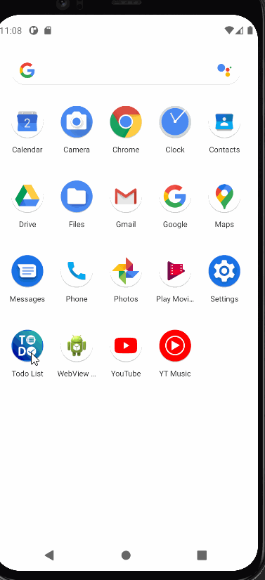

#Todo application
This is the simple todo application which contains splash screen a login form for the user.And it allows the user to perform certain task listed below:
*create task eg:complete homework and select the due date
*to update the task eg:homework has been complete
*delete the task

And it also contains a logout functionality which allows user to exits from the app .

